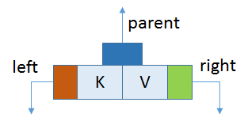
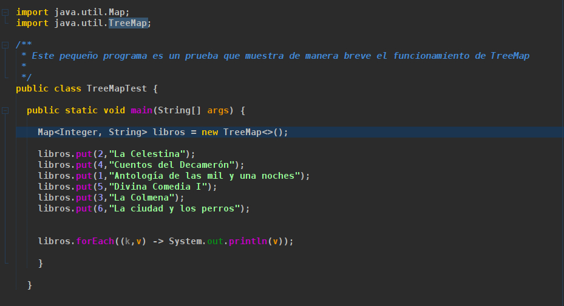
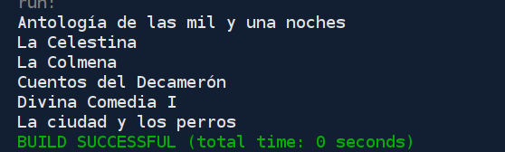

# TreeMap
En este repositorio se explica el funcionamiento de la clase TreeMap perteneciente a la colección Map&lt;E>

### TreeMap en Java

**TreeMap** en Java se usa para implementar la interfaz de Map y NavigableMap junto con la Clase Abstracta. Se ordena de acuerdo con el orden natural de sus claves, o mediante un comparador proporcionado en el momento de la creación, según el constructor utilizado. 

Esto demuestra ser una **forma eficiente** de ordenar y almacenar los pares **clave-valor**.  La implementación TreeMap no está sincronizada en el sentido de que si múltiples subprocesos acceden a el, al mismo tiempo y al menos uno de los hilos modifica el mapa estructuralmente, debe sincronizarse externamente. 

Algunas características importantes del treemap son:

  - Esta clase es miembro de Java Collections Framework.
  - La clase implementa interfaces de map que incluyen NavigableMap, SortedMap y extiende AbstractMap
  - TreeMap en Java no permite claves nulas (como Map) y, por lo tanto, se lanza una NullPointerException. Sin embargo, se         pueden   asociar múltiples valores nulos con diferentes claves.
  - Todos los pares Map.Entry devueltos por los métodos de esta clase y sus vistas representan instantáneas de asignaciones en     el momento en que se produjeron. No admiten el método Entry.setValue.
  
Estructura interna de TreeMap
TreeMap se basa en la estructura de datos de árbol. Cada nodo tiene tres referencias de su elemento primario, derecho e izquierdo. 

Nodo de mapa de árbol
Como puede ver en el diagrama, hay tres referencias en el nodo, como un elemento primario, derecho e izquierdo con las siguientes propiedades:

- El elemento izquierdo siempre será lógicamente menor que el elemento padre .
- El elemento derecho siempre será lógicamente mayor que O igual a un elemento padre
- La comparación lógica de objetos se realiza por orden natural, es decir, aquellos objetos que implementan una interfaz       comparable y anulan el método compareTo (Object obj).

### Funcionamiento de TreeMap
Este ejemplo muestra el funcionamiento de TreeMap

Una vez ejecutamos el programa se muestran los libros en orden natural por su clave

